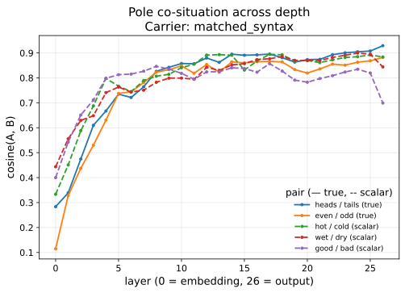
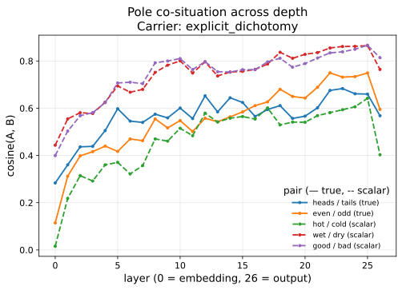
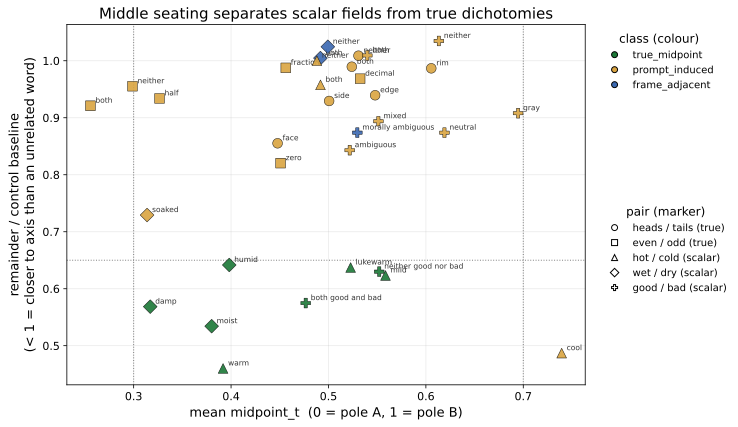
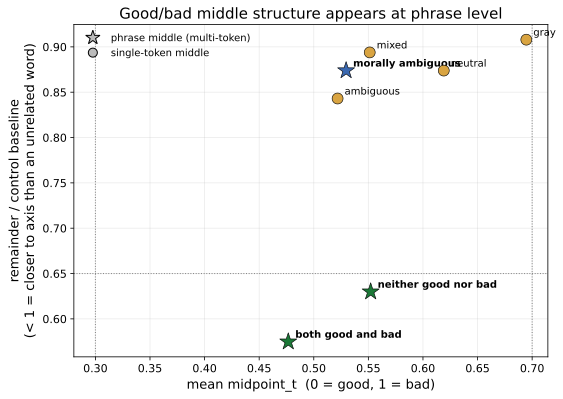

# When does a corpus-stable opposition stay binary in residual space?

## Dichotomy Transformation Probe v2

This repository contains the public materials for the Dichotomy Transformation Probe v2, an exploratory mechanistic-interpretability probe of relation-structure in transformer residual representations.

The probe intentionally uses corpus-known, culturally stabilized oppositions such as `heads/tails`, `even/odd`, `hot/cold`, `wet/dry`, and `good/bad`. The goal is not to discover whether the model has encountered these relations, but to observe what the residual stream does with already-stabilized relational forms across depth.

The central result is a dissociation: **pole co-situation does not imply middle seating**. In `heads/tails`, the poles become highly co-situated across depth while every candidate middle remains off-axis or prompt-induced. Scalar pairs such as `hot/cold` and `wet/dry` behave differently, producing stable midpoint candidates. The `good/bad` phrase-level result is promising but provisional pending lexical-echo controls.

## Unit-of-analysis guardrail

This project is motivated by a unit-of-analysis question, but it does not collapse human meaning into transformer internals.

Vygotsky’s X-unit, word meaning, motivates the methodological question but is not attributed to the transformer. The measured Y-unit is the evolving residual representation: a corpus-shaped token-position state transformed across depth by learned transformer operations.

Residual representations are treated as observable computational traces of relation-structure transformation inside a trained transformer, not as human word meanings.

## Load-bearing finding

The load-bearing finding is that **relation visibility and field exhaustion separate**.

High cosine between poles can coexist with failed middle seating. This means that pole co-situation alone cannot be interpreted as evidence that a relation has become scalar or that a middle has been represented.

In short:

> A named opposition can be highly visible in residual space without being exhausted by a represented middle.

## Figures

**Figure 1A. Pole co-situation across depth under matched-syntax carrier.** cosine(A,B) by layer for all five pairs under the matched-syntax carrier. One line per pair; solid lines indicate true dichotomies and dashed lines indicate scalar-collapse pairs.

**Figure 1B. Pole co-situation across depth under explicit-dichotomy carrier.** cosine(A,B) by layer for all five pairs under the explicit-dichotomy carrier. One line per pair; solid lines indicate true dichotomies and dashed lines indicate scalar-collapse pairs.

**Figure 2. Middle seating separates scalar fields from true dichotomies.** Scatter of every candidate middle, including single-token candidates, logical terms, and phrase middles; frame terms and unrelated controls are excluded. The x-axis is mean midpoint_t, where 0 = pole A and 1 = pole B. The y-axis is remainder_vs_control. Colour indicates descriptive class; marker indicates pair. Reference lines are shown at t = 0.3, t = 0.7, and y = 0.65. Candidates in the lower-middle band sit on the pole axis more tightly than an unrelated word; the true-dichotomy candidates do not.

**Figure 3. Good/bad middle structure appears at phrase level.** Good/bad candidates only. The x-axis is mean midpoint_t, where 0 = good and 1 = bad. The y-axis is remainder_vs_control. Stars indicate phrase middles; circles indicate single-token candidates. The phrases “both good and bad” (0.57) and “neither good nor bad” (0.63) fall below 0.65; the single-token candidates neutral, mixed, ambiguous, and gray do not.

## Source note

All figures use Gemma 2 2B base with 27 residual states across layers 0→output. Measurements are descriptive only: the machine determines nothing; the reader interprets; proximity and seating are corroboration only. `remainder_vs_control` is a candidate’s off-axis remainder divided by the pair’s unrelated-word baseline; values below 1 indicate the candidate is closer to the pole axis than an unrelated word.

## Paper downloads

- [Printable paper with long annotated references](papers/dichotomy_probe_v2/Dichotomy_Probe_v2_Revised_Long_Annotated_References_Print.pdf)
- [Printable paper with short references](papers/dichotomy_probe_v2/Dichotomy_Probe_v2_Revised_Short_References_Print.pdf)
- [Editable DOCX with long annotated references](papers/dichotomy_probe_v2/Dichotomy_Probe_v2_Revised_Long_Annotated_References.docx)
- [Editable DOCX with short references](papers/dichotomy_probe_v2/Dichotomy_Probe_v2_Revised_Short_References.docx)

## Status and limitations

Status: exploratory v2 report.

This version should be read as a descriptive residual-geometry probe, not a causal mechanistic explanation.

Known limitations:
- The `good/bad` phrase-level finding is provisional because the passing phrase candidates contain both pole tokens and require lexical-echo controls.
- Raw `cosine_AB` should be interpreted with caution because contextualized representations can be anisotropic; v3 should add unrelated-pair cosine baselines.
- Carrier stability should not be treated as substantive when matched and natural carriers are textually identical.
- The probe does not claim that the model understands dichotomy, morality, or human meaning.

## Suggested citation

Chambers Palmer, J. (2026). *When does a corpus-stable opposition stay binary in residual space? Dichotomy Transformation Probe v2*. GitHub repository, branch `dichotomy-probe`.

## License

This repository does not yet include a license file. Paper text and figures are © Jennifer Chambers Palmer, 2026, unless otherwise licensed.
